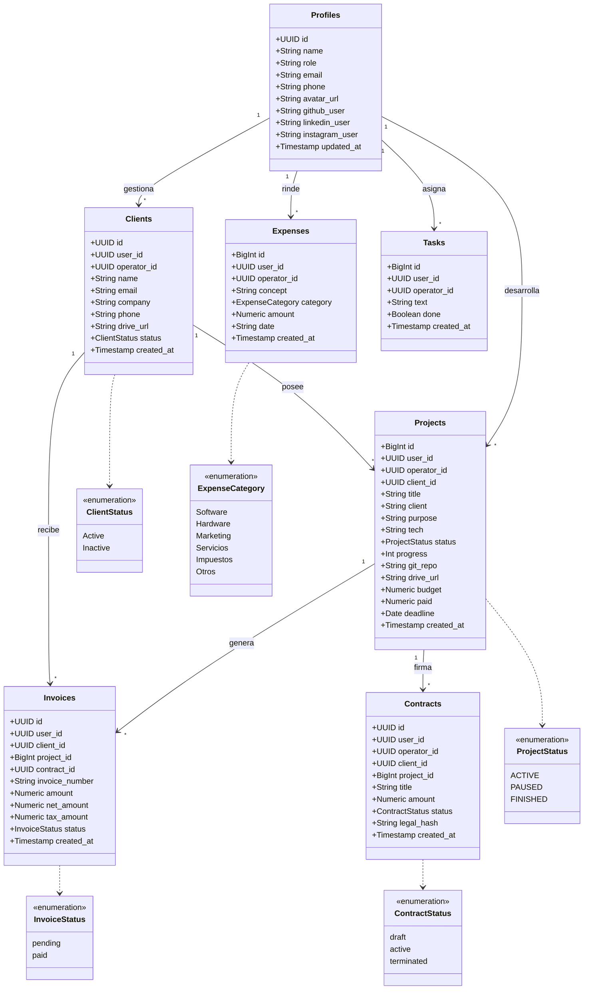

🚀 NEXUSSGE
Sistema Inteligente de Gestión para Freelancers y Agencias Digitales
👥 Grupo N° 7
Jeremias Sosa
Ivan Bustos
Emmanuel Bustos
Damian Lombardo

📌 Problema que Resuelve

Los freelancers y pequeñas agencias de desarrollo suelen trabajar con herramientas separadas para gestionar proyectos, clientes y finanzas. Esto genera desorganización, pérdida de tiempo y poca visibilidad sobre el estado real del negocio.

Las soluciones actuales son demasiado genéricas y no contemplan necesidades técnicas específicas como:

Seguimiento de stacks tecnológicos
Gestión de repositorios Git
Deadlines críticos
Flujo de caja multimoneda
Rentabilidad por proyecto
Métricas en tiempo real

NEXUSSGE centraliza todas estas funcionalidades en una única plataforma inteligente, permitiendo administrar proyectos, clientes y finanzas desde un solo lugar.

🎯 Objetivo del Sistema

Desarrollar una plataforma web moderna que permita a freelancers y pequeñas agencias digitales:

Gestionar proyectos y clientes
Monitorear estados y deadlines
Administrar ingresos y gastos
Visualizar métricas en tiempo real
Detectar riesgos automáticamente
Optimizar la productividad operativa
👥 Usuarios y Alcance

El sistema está orientado a:

Freelancers de desarrollo de software
Pequeñas agencias digitales
Equipos técnicos reducidos
Funcionalidades principales:

✅ Gestión completa del ciclo de vida de proyectos (Pipeline)
✅ CRM de clientes
✅ Dashboard analítico en tiempo real
✅ Sistema Smart Deadlines
✅ Gestión financiera y flujo de caja
✅ Soporte multimoneda (USD / ARS)
✅ Seguimiento técnico de repositorios y stacks
✅ Historial de facturación y pagos

🛠️ Stack Tecnológico

| Tecnología         | Uso                      |
| ------------------ | ------------------------ |
| React + TypeScript | Frontend                 |
| Vite               | Entorno de desarrollo    |
| Tailwind CSS       | Diseño UI/UX             |
| Supabase           | Backend y Base de Datos  |
| PostgreSQL         | Base de datos relacional |
| Git & GitHub       | Control de versiones     |

🧠 Justificación del Stack

⚛️ React + TypeScript + Vite

Se eligió React por su capacidad de construir interfaces dinámicas basadas en componentes reutilizables, fundamentales en una plataforma modular como NEXUSSGE.

TypeScript aporta tipado estático, reduciendo errores y facilitando el mantenimiento del proyecto a medida que escala.

Vite mejora significativamente la experiencia de desarrollo gracias a:

Hot reload instantáneo
Arranque rápido del proyecto
Build optimizado para producción

🎨 Tailwind CSS

Tailwind fue seleccionado porque el sistema requería una identidad visual completamente personalizada:

Glassmorphism
Bordes luminosos
Interfaz estilo HUD
Componentes modernos y responsivos

Esto permite construir una interfaz premium sin depender de componentes genéricos.

🛢️ Supabase + PostgreSQL

Supabase resuelve múltiples necesidades clave del proyecto:

Autenticación segura
Base de datos en tiempo real
API REST automática
Gestión simplificada del backend

Además, PostgreSQL ofrece:

Relaciones sólidas
Escalabilidad
Integridad de datos
Alto rendimiento
⚙️ Instrucciones de Setup

📋 Requisitos Previos

Node.js v18 o superior
npm

📥 Clonar Repositorio
git clone https://github.com/UCH-LDS-2026/grupo-07.git

📂 Entrar al Proyecto
cd grupo-07

📦 Instalar Dependencias
npm install

🔑 Configurar Variables de Entorno
Crear un archivo .env en la raíz del proyecto:

VITE_SUPABASE_URL=tu_supabase_url
VITE_SUPABASE_ANON_KEY=tu_supabase_anon_key

▶️ Ejecutar Proyecto
npm run dev

## 🏗️ Arquitectura del Sistema

El frontend desarrollado en React se conecta con la base de datos PostgreSQL
administrada por Supabase de manera directa mediante llamadas asíncronas.

El flujo es el siguiente:

1. El usuario interactúa con la interfaz React
2. Se realizan llamadas asíncronas a la API REST de Supabase
3. Supabase procesa la solicitud contra la base de datos PostgreSQL
4. La respuesta regresa al frontend y actualiza la UI en tiempo real

Esta arquitectura permite prescindir de un backend propio, reduciendo
complejidad y tiempo de desarrollo.
🌿 Estrategia de Ramas

El equipo utiliza una estrategia basada en GitFlow Simplificado.

| Rama      | Descripción                            |
| --------- | -------------------------------------- |
| `main`    | Rama protegida con versiones estables  |
| `develop` | Rama de integración de funcionalidades |

Reglas:
❌ No se permiten commits directos a main
✅ Todo cambio pasa primero por develop
✅ Uso de Pull Requests para integración

📊 Diagramas del Sistema

📐 Diagrama de Clases

📌 Diagrama de Casos de Uso

💡 Características Destacadas

📈 Dashboard Inteligente

Visualización en tiempo real de:

Proyectos activos
Flujo de caja
Ingresos mensuales
Rentabilidad
Estado de deadlines
🧠 Smart Deadlines

Sistema inteligente que:

Detecta proyectos en riesgo
Analiza progreso vs deadline
Sugiere acciones correctivas
Genera recomendaciones automáticas

💰 Gestión Financiera
Control de gastos
Historial de pagos
Facturación
Soporte USD / ARS
Flujo de caja

🔗 Gestión Técnica

Cada proyecto puede incluir:

Stack tecnológico
Repositorio Git
Documentación
Estado del pipeline
🚀 Estado del Proyecto

✅ Frontend funcional
✅ Diseño UI/UX implementado
✅ Integración con Supabase
✅ Sistema de autenticación
✅ Gestión de proyectos
✅ Dashboard dinámico

📌 Conclusión

NEXUSSGE busca convertirse en una solución integral para freelancers y pequeñas agencias, combinando:

Gestión operativa
Seguimiento técnico
Inteligencia analítica
Control financiero

Todo dentro de una única plataforma moderna, escalable y visualmente profesional.
